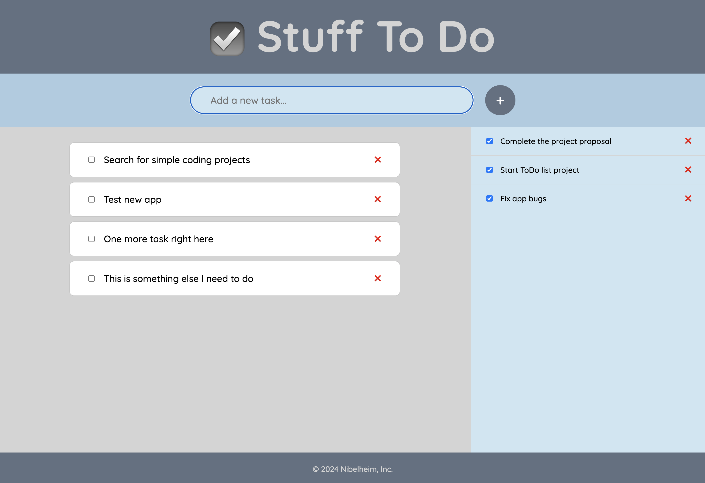

# Simple ToDo List made using React

This is a simple ToDo List done using React.

Features:

- Adding new tasks using a form input
- Marking tasks as finished/done
- The finished tasks show up on the side bar
- User can completely delete a task

This is the remake of the same app I made using vanilla Javascript. I wanted to check how they compare, and even with a simple app like this, the fact that React makes so easy to control the state and the re-renders of the interface I have to say that I liked the React workflow much better.

I tried to stay far from frameworks but I'll keep using React.

